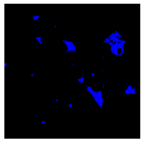

<!-- # WSSL-Weighted-Self-Supervised-Learning-for-Image-Inpainting -->
<br />
<p align="center">

  <h1 align="center">Analysis and application of multispectral data for water segmentation using machine learning</h1>
  
  <p align="center">
    Water Segementation from Sentinel-2
    <br />
  </p>
</p>

# Abstract
<p align="justify">
    Monitoring water is a complex task due to its dynamic nature, added pollutants, and land build-up. The availability of high-resolution data by Sentinel-2 multispectral products makes implementing remote sensing applications feasible. However, overutilizing or underutilizing multispectral bands of the product can lead to inferior performance. In this work, we compare the performances of ten out of the thirteenbands available in a Sentinel-2 product for water segmentation using eight machine learning algorithms. We find that the shortwave infrared bands (B11 and B12) are the most superior for segmenting water bodies.B11 achieves an overall accuracy of 71% while B12 achieves 69% across all algorithms on the test site. We also find that the Support Vector Machine (SVM) algorithm is the most favourable for single-band water segmentation. The SVM achieves an overall accuracy of 69% across the tested bands over the given test site. Finally, to demonstrate the effectiveness of choosing the right amount of data, we use only B11 reflectance data to train an artificial neural network, BandNet. Even with abasic architecture, BandNet is proportionate to known architectures for semantic and water segmentation, achieving a 92.47 mIOU on the test site. BandNet requires only a fraction of the time and resources to train and run inference, making it suitable to be deployed on web applications to run and monitor water bodies in localized regions. Our codebase is available at https://github.com/IamShubhamGupto/BandNet
    <br />
</p>

<br>
<p align="center">
     
</p>

# Environment 
All dependencies are prvided in the form of a conda environment yml file. The file is generated on a Windows 11 machine.
```
cd BandNet
conda env create -f environment.yml

```
## Additional software and resources
Users are required to download and install [SNAP](https://step.esa.int/main/download/snap-download/) to setup the python interface ```snappy```. <b>This cannot be installed by conda or pip directly.</b> This [link](https://senbox.atlassian.net/wiki/spaces/SNAP/pages/50855941/Configure+Python+to+use+the+SNAP-Python+snappy+interface) might be helpful in setting up snappy.
# Dataset
We use Sentinel-2 products available from [Copernicus](https://scihub.copernicus.eu/dhus/#/home). Refer to the paper for product details.

# Pretrained weights
There are no pretrained weights provided as they are easy and quick to reproduce. The code to save the weights is provided with in notebooks.

# Results
| <b> Annotation </b>    | <b> [DeepWaterMapv2](https://github.com/isikdogan/deepwatermap) </b>| <b> [WatNet](https://github.com/xinluo2018/WatNet) </b>|<b> BanNet </b>|
| ------------- | -------------| -------------| -------------|
|  | | | |
|  | | | |
# Reference
If you find our work useful, please cite using
### bibtex
```latex
@misc{https://doi.org/10.48550/arxiv.2212.08749,
  doi = {10.48550/ARXIV.2212.08749},
  
  url = {https://arxiv.org/abs/2212.08749},
  
  author = {Gupta, Shubham and D., Uma and Hebbar, Ramachandra},
  
  keywords = {Computer Vision and Pattern Recognition (cs.CV), FOS: Computer and information sciences, FOS: Computer and information sciences},
  
  title = {Analysis and application of multispectral data for water segmentation using machine learning},
  
  publisher = {arXiv},
  
  year = {2022},
  
  copyright = {Creative Commons Attribution 4.0 International}
}

```

## License
This work is licensed under the [MIT License](./LICENSE)